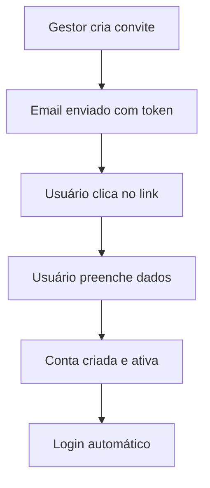
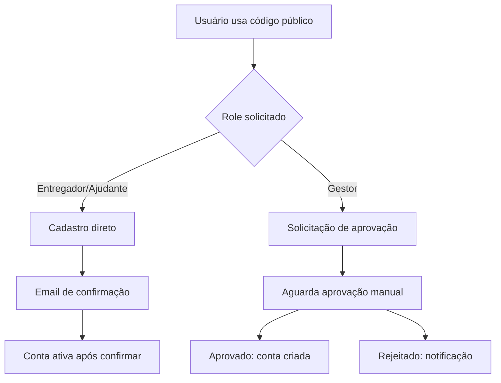

# 🚀 Fluxo Profissional de Cadastro de Usuário - API Trabiju Telemetria

## 📋 **Visão Geral do Sistema**

Este documento descreve o **fluxo completo e profissional** de cadastro de usuários implementado na API de telemetria.

## 🔄 **Tipos de Cadastro Disponíveis**

### **1. 📧 Cadastro por Convite (Recomendado)**


**Características:**
- ✅ **Aprovação automática** (pré-aprovado pelo gestor)
- ✅ **Login imediato** após aceitar convite
- ✅ **Email de confirmação** desnecessário
- ✅ **Token com expiração** (7 dias)

### **2. 🔑 Cadastro com Código da Empresa**


**Características:**
- ⚖️ **Aprovação baseada no papel**:
  - `entregador/ajudante`: Cadastro direto
  - `gestor`: Aprovação manual obrigatória
- 📧 **Validação de email obrigatória**
- ⏳ **Conta inativa** até confirmar email

### **3. ✉️ Sistema de Validação de Email**
- **Confirmação obrigatória** para cadastros com código
- **Token único** com expiração de 24h
- **Link direto** para ativação da conta
- **Reenvio automático** se necessário

---

## 🔐 **Configurações JWT**

### **Duração dos Tokens:**
- **Access Token**: 24 horas
- **Refresh Token**: 7 dias
- **Confirmação Email**: 24 horas
- **Convites**: 7 dias

### **Informações no Token:**
```json
{
  "user_id": 123,
  "email": "usuario@empresa.com",
  "role_id": 2,
  "empresa_id": 1,
  "exp": 1721720400,
  "iss": "trabiju-telemetria"
}
```

---

## 🛡️ **Middlewares Implementados**

### **1. AuthMiddleware**
- Valida JWT nos headers
- Extrai informações do usuário
- Bloqueia acesso não autorizado

### **2. RoleMiddleware**
- Controla acesso por papel
- Hierarquia de permissões:
  - `admin` → Acesso total
  - `gestor` → Gerencia empresa
  - `entregador` → Operações básicas
  - `ajudante` → Acesso limitado

### **3. SecurityMiddleware**
- Headers de segurança
- CORS configurado
- Rate limiting (planejado)

---

## 🗄️ **Repositórios Criados**

### **UserRepository**
- ✅ Criar usuário
- ✅ Buscar por email/ID
- ✅ Verificar duplicatas (email/CPF)
- ✅ Ativar usuário
- ✅ Controle de login (tentativas/bloqueio)

### **InviteRepository**
- ✅ Criar convites
- ✅ Buscar por token
- ✅ Marcar como usado
- ✅ Limpeza automática de expirados

### **CompanyRepository**
- ✅ Buscar por código de convite
- ✅ Validar empresa ativa

### **RegistrationRequestRepository**
- ✅ Criar solicitações
- ✅ Aprovar/Rejeitar
- ✅ Buscar pendentes por empresa

---

## 🎯 **Endpoints da API**

### **Públicos (sem autenticação):**
```http
POST /api/v1/auth/login
POST /api/v1/auth/register/code
POST /api/v1/auth/invite/accept
POST /api/v1/auth/refresh
GET  /api/v1/auth/confirm-email
```

### **Protegidos (requer JWT):**
```http
GET  /api/v1/auth/profile
POST /api/v1/auth/logout
```

### **Admin/Gestor apenas:**
```http
GET  /api/v1/admin/db/status
GET  /api/v1/admin/db/health
```

---

## 📝 **Exemplos de Uso**

### **1. Cadastro com Código da Empresa**
```bash
curl -X POST http://localhost:8081/api/v1/auth/register/code \
  -H "Content-Type: application/json" \
  -d '{
    "nome": "João Silva",
    "email": "joao@email.com",
    "senha": "senha123",
    "telefone": "(11) 99999-9999",
    "cpf": "123.456.789-00",
    "codigo_empresa": "TELEME2025",
    "role_desejado": "entregador",
    "justificativa": "Experiência de 5 anos"
  }'
```

### **2. Login**
```bash
curl -X POST http://localhost:8081/api/v1/auth/login \
  -H "Content-Type: application/json" \
  -d '{
    "email": "joao@email.com",
    "senha": "senha123"
  }'
```

### **3. Aceitar Convite**
```bash
curl -X POST http://localhost:8081/api/v1/auth/invite/accept \
  -H "Content-Type: application/json" \
  -d '{
    "token": "abc123def456",
    "nome": "Maria Santos",
    "senha": "senha123",
    "telefone": "(11) 88888-8888",
    "cpf": "987.654.321-00"
  }'
```

---

## ⚙️ **Variáveis de Ambiente Necessárias**

```env
# Database
DB_HOST=mysql
DB_PORT=3306
DB_USER=root
DB_PASSWORD=senha123
DB_NAME=trabiju_telemetria

# JWT
JWT_SECRET=seu-jwt-secret-super-seguro
JWT_EXPIRY_HOURS=24

# Email/SMTP
SMTP_HOST=smtp.gmail.com
SMTP_PORT=587
SMTP_USER=seu-email@gmail.com
SMTP_PASSWORD=sua-senha-app
FROM_EMAIL=noreply@gestaotelemetria.com
FROM_NAME=Gestão Telemetria

# Application
ENVIRONMENT=development
PORT=8080
FRONTEND_URL=http://localhost:3000
ADMIN_EMAIL=admin@gestaotelemetria.com
```

---

## ✅ **Próximos Passos**

### **Para implementar:**
1. **Atualizar go.mod** com dependências:
   ```bash
   go mod tidy
   go get golang.org/x/crypto/bcrypt
   go get github.com/golang-jwt/jwt/v5
   go get github.com/gin-contrib/cors
   ```

2. **Configurar variáveis** no `.env`

3. **Testar endpoints** com dados reais

4. **Implementar validações** adicionais conforme necessário

### **Melhorias futuras:**
- [ ] Sistema de blacklist para JWT
- [ ] Rate limiting com Redis
- [ ] Logs estruturados
- [ ] Métricas de autenticação
- [ ] Two-factor authentication (2FA)
- [ ] Reset de senha
- [ ] Auditoria de acessos

---

## 🎉 **Fluxo Está Pronto!**

O sistema agora possui um **fluxo profissional completo** de cadastro com:
- ✅ **3 tipos de cadastro** diferentes
- ✅ **Validação de email** obrigatória
- ✅ **JWT com refresh token**
- ✅ **Middlewares de segurança**
- ✅ **Controle de acesso por roles**
- ✅ **Sistema de convites**
- ✅ **Aprovação manual** para gestores
- ✅ **Login automático** após cadastro por convite
- ✅ **Repositórios organizados**
- ✅ **Configuração centralizizada**

**Tempo de duração do login**: 24 horas (configurável)
**Login após cadastro**: Sim, se por convite ou após confirmar email
